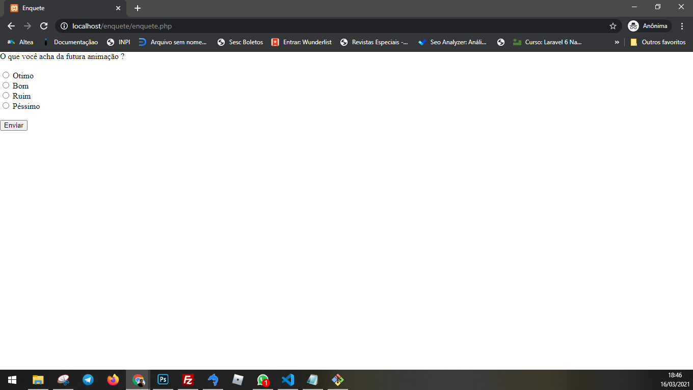

# survey Simple
> Developed in PHP5, it is a basic survey to implement on your website.


## Installation

```sh
Change the db.ini file and send the 3 files to the server!
```
## Other option

You can also edit the file enquete.php which is the file where the inputs are, they are marked with comments in the enquete.php.
You can edit the enquete.php the way you prefer, keeping it in "echo" or "<?php ?>" Inside the tags ...

## Contributing

1. Fork it (<https://github.com/wanderson-r-marques/enquete>)
2. Create your feature branch (`git checkout -b feature/fooBar`)
3. Commit your changes (`git commit -am 'Add some fooBar'`)
4. Push to the branch (`git push origin feature/fooBar`)
5. Create a new Pull Request
